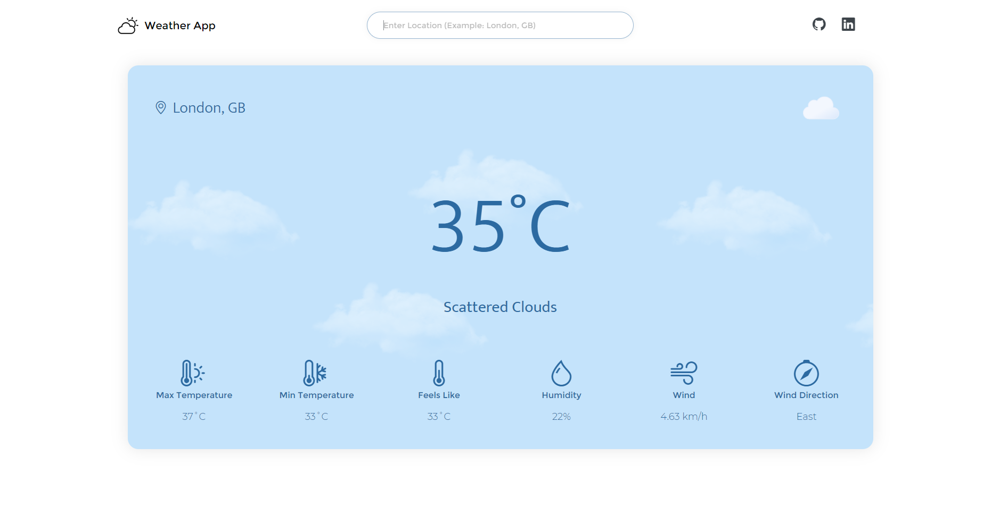

# 🌥 Weather App.

[Live Demo](https://weather-app-omega-lilac.vercel.app).

A weather application with React.js and [OpenWeatherAPI](https://openweathermap.org).

This is the pack of icons I used: [Meteocons](https://bas.dev/work/meteocons).
